# network-2022spring

## ディレクトリ構成

```text
.
├── README.md
├── diagrams
│   └── vlan.drawio.svg  # トポロジ
├── pkt
│   ├── running-config
│   │   ├── Router-main-1941.txt  # pktのconfig
│   │   ├── Switch-sub1-2960.txt  # pktのconfig
│   │   └── Switch-sub2-2960.txt  # pktのconfig
│   └── vlan.pkt  # Packet Tracer
└── running-config
    ├── router-main.txt  # ルータ (真ん中)
    ├── router-sub1.txt  # ルータ (左)
    └── router-sub2.txt  # ルータ (右)
```

## トポロジ


